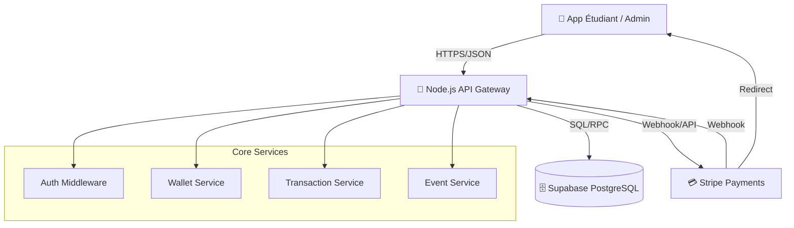

# 💰 Epicoin Wallet - Système de Paiement Étudiant

Une solution complète de portefeuille numérique pour les associations étudiantes (BDE), permettant la gestion de crédits, le paiement d'événements et le suivi financier.

## 🏗 Architecture & Choix Technologiques

Ce projet a été conçu pour être **performant, modulable et facile à déployer**.



### 🧱 Stack Technique

| Composant | Technologie | Pourquoi ce choix ? |
|-----------|-------------|---------------------|
| **Backend** | **Node.js + Express** | Architecture événementielle non-bloquante idéale pour les transactions en temps réel. Écosystème riche et développement rapide. |
| **Base de Données** | **Supabase (PostgreSQL)** | Puissance du SQL relationnel combinée à une API moderne. Sécurité (RLS), scalabilité et gestion facile des données. |
| **Frontend** | **Vanilla JS + HTML5 + CSS3** | Performance native maximale, aucun temps de build, légèreté absolue. Design "Premium" avec CSS moderne (Glassmorphism). |
| **Paiement** | **Stripe** | Standard de l'industrie pour les paiements sécurisés. Gestion des sessions de checkout et webhooks (avec fallback manuel robuste). |

---

## ✨ Fonctionnalités Clés

### 🎓 Pour les Étudiants
- **Portefeuille Numérique** : Solde en temps réel (Crédits & Euros).
- **Historique** : Suivi détaillé de toutes les transactions (Entrées/Sorties).
- **Rechargement** : Achat de crédits via Stripe (Carte Bancaire).
- **Événements** : Inscription aux événements BDE et paiement en crédits.
- **Paiements BDE** : Virement instantané vers le BDE ou paiement via QR Code (simulé).

### 🛡️ Pour les Admins & BDE
- **Dashboard Financier** : Vue globale sur la trésorerie, volumes de ventes et statistiques.
- **Gestion Événements** : Création, modification et suivi des participants.
- **Gestion Étudiants** : Vue liste des utilisateurs, solde et actions rapides.
- **Validation** : Scan/Check-in des participants aux événements.

---

## 🚀 Installation & Démarrage

### Pré-requis
- Node.js (v18+)
- Compte Supabase
- Compte Stripe

### 1. Clonage et Installation
```bash
git clone https://github.com/votre-repo/wallet-ia-sans-ia.git
cd Wallet-IAsansIA
npm install
```

### 2. Configuration (`.env`)
Copiez le fichier d'exemple et remplissez vos clés :
```bash
cp .env.example .env
```
Assurez-vous d'avoir :
- `SUPABASE_URL` & `SUPABASE_SERVICE_ROLE_KEY`
- `STRIPE_SECRET_KEY`

### 3. Lancement
```bash
# Mode développement (avec redémarrage automatique)
npm run dev

# Lancer les tests unitaires
npm test

# Le serveur sera accessible sur http://localhost:3002
```

## 🔄 Flux de Paiement (Diagramme de Séquence)

```mermaid
sequenceDiagram
    participant User as 👤 Étudiant
    participant UI as 📱 Frontend
    participant API as 🚀 Backend
    participant Stripe as 💳 Stripe
    participant DB as 🗄️ Database

    User->>UI: Clique "Acheter 100 Crédits"
    UI->>API: POST /create-checkout-session
    API->>Stripe: Crée Session
    Stripe-->>API: URL de Paiement
    API-->>UI: Redirection
    UI->>User: Page de Paiement Stripe
    User->>Stripe: Paie par CB
    Stripe->>UI: Redirection /success
    
    rect rgb(20, 30, 40)
        Note right of UI: Vérification Robuste
        UI->>API: POST /verify-session (Auto-call)
        API->>Stripe: Vérifie statut "paid"
        API->>DB: Check/Create Wallet, Insert Transaction (CASHIN)
        DB-->>API: OK
        API-->>UI: Succès & Nouveau Solde
    end
```




## 💸 Protocole d'Échange de Crédits (P2P et BDE)

Le système gère plusieurs types de flux financiers entre les entités (Étudiants, BDE, Système).

### 1. Achat de Crédits (Fiat -> Token)
- **Source** : Carte Bancaire (Stripe)
- **Destination** : Portefeuille Étudiant (CREDITS) **ET** Portefeuille BDE (EUR)
- **Logique** : L'étudiant reçoit des tokens utilisables dans l'écosystème. Le BDE reçoit instantanément la contre-valeur en Euros.

### 2. Transfert P2P (Étudiant -> Étudiant)
Permet le remboursement ou le partage de frais entre étudiants.

```mermaid
sequenceDiagram
    participant Sender as 📤 Envoyeur
    participant API as ⚡ Backend
    participant DB as 🗄️ Database
    participant Receiver as 📥 Receveur

    Sender->>API: POST /transfer (TargetEmail, Amount)
    API->>DB: Vérifie Solde Envoyeur > Amount
    API->>DB: Trouve Wallet ID Receveur
    
    rect rgb(30, 20, 40)
        Note right of API: Transaction Atomique
        API->>DB: Débite Envoyeur (-Amount)
        API->>DB: Crédite Receveur (+Amount)
        API->>DB: Log Transaction (Type: TRANSFER)
    end
    
    DB-->>API: Succès
    API-->>Sender: Confirmation (Nouveau Solde)
    Note left of Receiver: Notifié par Email/Notif
```



### 3. Paiement BDE (Étudiant -> BDE)
Utilisé pour payer un événement ou une consommation.
- **Flux** : Débit Wallet Étudiant -> Crédit Wallet BDE (en Crédits)
- **Validation** : Scan QR Code ou Validation Manuelle par Admin.

### 4. Spécification Technique (JSON Protocol)

Pour initier une transaction (Endpoint: `POST /api/transactions`), le payload JSON suivant est requis :

```json
{
  "initiatorUserId": "uuid-v4",       // ID de l'utilisateur qui initie
  "sourceWalletId": "uuid-v4",        // Portefeuille à débiter
  "destinationWalletId": "uuid-v4",   // Portefeuille à créditer
  "amount": 10.50,                    // Montant (positif uniquement)
  "transactionType": "P2P",           // Enum: [P2P, MERCHANT, CASHIN, CASHOUT]
  "currency": "CREDITS",              // (Optionnel) Default: CREDITS
  "description": "Remboursement Pizza" // (Optionnel) Max 500 chars
}
```

**Réponse (Succès 201)** :
```json
{
  "success": true,
  "data": {
    "transaction_id": "uuid-v4",
    "status": "PENDING", // ou SUCCESS immédiat
    "created_at": "ISO-8601 Timestamp"
  }
}
```

---


Etude des possibilités d’implémentations de l’IA pour notre concept de wallet étudiant BDE
IA pour fidéliser


1. Le "Smart Trust Score" : 

Valorisation de l'engagement étudiant
Plutôt qu'un moteur de recommandation, vous pouvez implémenter un Score Dynamique Utilisateur (Trust Score), déjà identifié comme une fonctionnalité à fort potentiel dans le contrat de livraison.


• Le concept : L'IA analyse la régularité des interactions, la participation aux événements et la fiabilité des paiements pour attribuer un score de confiance à l'étudiant.


• Rentabilité pour Carte Blanche : Cette fonctionnalité renforce votre moteur de détection de fraude hybride. En réduisant les faux positifs, vous diminuez les coûts opérationnels liés à l'analyse manuelle des transactions suspectes par vos analystes. C'est un argument de vente majeur (SaaS Premium).


• Rentabilité pour le BDE : Le BDE peut automatiser des privilèges (ex: accès "coupe-file" à un événement ou tarifs préférentiels) pour les étudiants ayant les meilleurs scores. Cela incite à une utilisation régulière du wallet, augmentant ainsi le volume de transactions géré par l'association.


2. IA Prédictive pour l'Analyse des Tendances de Campus


Le marché de la vie étudiante manque d'outils de pilotage analytique. Votre IA peut devenir un outil de Business Intelligence pour les associations.


• Le concept : Utiliser l'IA pour prédire les pics de fréquentation ou le succès d'un futur événement en fonction des données historiques de participation.


• Rentabilité pour Carte Blanche : Vous pouvez proposer un Dashboard Analyste avancé sous forme d'abonnement mensuel aux directions d'établissements qui souhaitent "moderniser les outils de gestion associative".


• Rentabilité pour le BDE : En prédisant mieux l'affluence, le BDE optimise ses stocks (boissons, fournitures pour événements) et évite le gaspillage financier. Une meilleure gestion budgétaire est un bénéfice direct identifié dans les sources.


3. Le Moteur de "Nudging" Social et Collaboratif

Au lieu de pousser à la consommation de snacks, l'IA peut encourager des comportements communautaires positifs.

• Le concept : L'IA identifie des "missions" pour les étudiants (ex: "Participer à une collecte de vêtements organisée par le BDE pour gagner 50 crédit BDEs"). L'IA optimise la distribution de ces crédit BDEs bonus pour équilibrer la participation entre les différentes activités du campus.

• Rentabilité pour Carte Blanche : Vous vous différenciez radicalement de concurrents comme Izly, qui sont purement transactionnels. Cette "dimension communautaire et sociale" est votre principal facteur de différenciation sur le marché.

• Rentabilité pour le BDE : Plus l'engagement est fort, plus le BDE a de poids pour négocier des partenariats extérieurs (cinémas, salles de sport, librairies). Le BDE peut monétiser la visibilité offerte par l'application auprès de ces partenaires grâce aux statistiques d'engagement fournies par votre plateforme.
IA pour contrer les dérives
1. La Détection d'Anomalies Contextuelles (Scoring temps réel)

Niveau : Intermédiaire (S'active lors de chaque transaction ou interaction)
Cette fonctionnalité est le cœur du moteur hybride décrit dans les documents. Elle combine des modèles d'IA (type Random Forest ou XGBoost) pour calculer une probabilité de fraude en temps réel lors d'un paiement ou d'une obtention de crédit BDE.
• Utilité : Elle analyse des signaux croisés comme la vélocité (ex: 5 transactions en 2 minutes), l'heure inhabituelle (ex: 3h du matin) ou la distance géographique.
• Prévention des dérives : Elle cible directement les fraudes à la vélocité et les montants atypiques. Par exemple, si un étudiant tente de valider sa présence à trois événements simultanés dans des lieux différents, l'IA rejette la transaction ou déclenche une authentification forte (SCA) dynamique.
• Mise en œuvre : Le système garantit une latence de calcul inférieure à 500ms pour ne pas bloquer les flux sur le campus.

2. IA de Conformité et de Sécurité Automatisée

La conformité (RGPD, ACPR, PSD2) est une barrière à l'entrée complexe pour les petites structures.

• Le concept : Une IA spécialisée dans la surveillance et la génération automatique de rapports d'audit. Elle s'assure que toutes les transactions respectent les seuils de risque en temps réel sans intervention humaine constante.

• Rentabilité pour Carte Blanche : En automatisant la génération des rapports d'audit et la surveillance AML/KYC (anti-blanchiment), vous réduisez vos besoins en personnel de support technique et juridique.

• Rentabilité pour le BDE : Le BDE est protégé juridiquement et financièrement. L'IA réduit les pertes liées aux abus ou à la fraude, ce qui a un impact direct sur leur retour sur investissement (ROI)

3. La Détection d'Anomalies Contextuelles (Scoring temps réel)

Niveau : Plus situationnel (Spécifique aux réseaux de fraude et transferts suspects)
Bien que les sources se concentrent sur les transactions individuelles, elles mentionnent la nécessité de surveiller les "transferts suspects" et les "comportements atypiques". L'IA d'analyse de graphes est la plus situationnelle car elle n'intervient que pour détecter des relations entre plusieurs comptes.
• Utilité : Cette IA cartographie les interactions entre les portefeuilles (wallets). Elle cherche des schémas de collusion, comme des transferts circulaires de crédit BDEs ou des groupes d'étudiants qui "partagent" leurs récompenses de manière artificielle pour contourner les plafonds.
• Prévention des dérives : C'est l'outil idéal contre le blanchiment indirect ou les fermes à clics/engagements où un petit groupe d'étudiants tenterait de monopoliser les avantages du BDE en créant des réseaux de comptes factices.
• Mise en œuvre : Ces analyses sont souvent réalisées a posteriori via le Dashboard Streamlit de l'analyste, permettant d'identifier des structures de fraude complexes qui échappent aux règles métier classiques.
En combinant ces trois niveaux, le projet assure non seulement une conformité réglementaire (ACPR, PSD2), mais devient une plateforme Fintech capable de protéger l'économie interne du campus contre des attaques coordonnées.
IA pour le Pilotage & la Gouvernance Associative
1. Le “Campus Pulse AI”
Pilotage intelligent de la vie associative
Aujourd’hui, les décisions des BDE reposent principalement sur l’intuition ou l’expérience des équipes, souvent renouvelées chaque année. L’IA peut devenir un véritable outil de gouvernance et d’aide à la décision.
• Le concept : L’IA analyse l’ensemble des données d’activité du wallet (transactions, participation aux événements, périodes d’inactivité, types d’achats) afin de générer des indicateurs synthétiques de santé associative. Elle met en évidence :
les événements réellement engageants,
les périodes de décrochage,
les actions à forte valeur pour la communauté.
Ces analyses sont traduites en tableaux de bord clairs et exploitables, accessibles aux responsables associatifs et aux directions d’établissement.
• Rentabilité pour Carte Blanche : Cette fonctionnalité positionne Carte Blanche comme une solution de pilotage stratégique et non comme un simple wallet. Elle peut être proposée sous forme de module SaaS avancé (Analytics & Gouvernance), avec un fort potentiel de montée en gamme auprès des établissements.
• Rentabilité pour le BDE : Le BDE bénéficie d’un outil de décision objectif, facilitant la passation entre équipes et la justification de ses choix auprès de l’administration. Cela permet une meilleure allocation des budgets, une continuité dans les actions associatives et une professionnalisation de la gestion.
IA pour l’Expérience Utilisateur & l’Onboarding Étudiant
2. Le “Smart Onboarding Campus”
Accompagnement intelligent des nouveaux étudiants
Chaque année, les BDE font face à un afflux de nouveaux étudiants qui ne connaissent ni les événements, ni les usages, ni le fonctionnement de la vie associative.
• Le concept : Une IA d’onboarding analyse le comportement des nouveaux utilisateurs lors de leurs premières interactions (création du wallet, premières transactions, participation initiale) afin d’adapter automatiquement :
le rythme de découverte des fonctionnalités,
les premières opportunités d’engagement,
les messages d’accompagnement.


L’IA identifie les profils à risque de décrochage précoce et déclenche des parcours simplifiés ou des incitations adaptées.
• Rentabilité pour Carte Blanche : En améliorant l’activation et la rétention dès les premières semaines, Carte Blanche réduit fortement le churn utilisateur. Cette fonctionnalité renforce la valeur du produit pour les établissements, en faisant de l’outil un levier d’intégration étudiante clé.


Conclusion
Après avoir exploré de manière approfondie cinq axes de développement pour l'intelligence artificielle notamment la fidélisation, l'analyse prédictive, le pilotage associatif et l'onboarding intelligent nous avons conclu qu'aucune de ces fonctionnalités ne présentait une valeur ajoutée suffisante pour justifier leur implémentation, car elles s'avéraient soit trop coûteuses en performances serveur, soit trop chronophages à développer. Par exemple, les systèmes de recommandation ont été écartés pour des raisons de rentabilité et d'éthique, car ils auraient encouragé des habitudes alimentaires peu saines chez les étudiants. En conséquence, nous avons décidé de concentrer l'usage de l'IA uniquement sur une analyse de fraude et de détection d'anomalies en temps réel. Ce choix stratégique repose sur l'utilisation de modèles capables de calculer une probabilité de fraude lors des transactions pour contrer les dérives (vélocité, montants atypiques), garantissant ainsi la sécurité de l'économie interne du campus et la conformité réglementaire sans alourdir inutilement la structure technique du projet. Cette approche nous permet de maintenir une solution rentable tout en offrant un "Trust Score" fiable, essentiel pour la protection des BDE.


