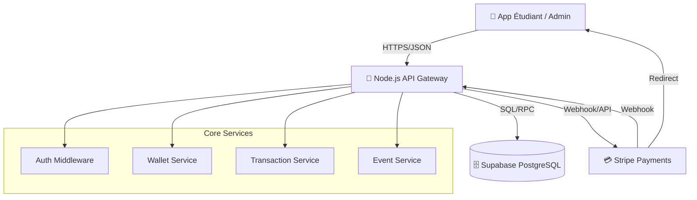

# 💰 Epicoin Wallet - Système de Paiement Étudiant

Une solution complète de portefeuille numérique pour les associations étudiantes (BDE), permettant la gestion de crédits, le paiement d'événements et le suivi financier.

## 🏗 Architecture & Choix Technologiques

Ce projet a été conçu pour être **performant, modulable et facile à déployer**.



### 🧱 Stack Technique

| Composant | Technologie | Pourquoi ce choix ? |
|-----------|-------------|---------------------|
| **Backend** | **Node.js + Express** | Architecture événementielle non-bloquante idéale pour les transactions en temps réel. Écosystème riche et développement rapide. |
| **Base de Données** | **Supabase (PostgreSQL)** | Puissance du SQL relationnel combinée à une API moderne. Sécurité (RLS), scalabilité et gestion facile des données. |
| **Frontend** | **Vanilla JS + HTML5 + CSS3** | Performance native maximale, aucun temps de build, légèreté absolue. Design "Premium" avec CSS moderne (Glassmorphism). |
| **Paiement** | **Stripe** | Standard de l'industrie pour les paiements sécurisés. Gestion des sessions de checkout et webhooks (avec fallback manuel robuste). |

---

## ✨ Fonctionnalités Clés

### 🎓 Pour les Étudiants
- **Portefeuille Numérique** : Solde en temps réel (Crédits & Euros).
- **Historique** : Suivi détaillé de toutes les transactions (Entrées/Sorties).
- **Rechargement** : Achat de crédits via Stripe (Carte Bancaire).
- **Événements** : Inscription aux événements BDE et paiement en crédits.
- **Paiements BDE** : Virement instantané vers le BDE ou paiement via QR Code (simulé).

### 🛡️ Pour les Admins & BDE
- **Dashboard Financier** : Vue globale sur la trésorerie, volumes de ventes et statistiques.
- **Gestion Événements** : Création, modification et suivi des participants.
- **Gestion Étudiants** : Vue liste des utilisateurs, solde et actions rapides.
- **Validation** : Scan/Check-in des participants aux événements.

---

## 🚀 Installation & Démarrage

### Pré-requis
- Node.js (v18+)
- Compte Supabase
- Compte Stripe

### 1. Clonage et Installation
```bash
git clone https://github.com/votre-repo/wallet-ia-sans-ia.git
cd Wallet-IAsansIA
npm install
```

### 2. Configuration (`.env`)
Copiez le fichier d'exemple et remplissez vos clés :
```bash
cp .env.example .env
```
Assurez-vous d'avoir :
- `SUPABASE_URL` & `SUPABASE_SERVICE_ROLE_KEY`
- `STRIPE_SECRET_KEY`

### 3. Lancement
```bash
# Mode développement (avec redémarrage automatique)
npm run dev

# Lancer les tests unitaires
npm test

# Le serveur sera accessible sur http://localhost:3002
```

## 🔄 Flux de Paiement (Diagramme de Séquence)

```mermaid
sequenceDiagram
    participant User as 👤 Étudiant
    participant UI as 📱 Frontend
    participant API as 🚀 Backend
    participant Stripe as 💳 Stripe
    participant DB as 🗄️ Database

    User->>UI: Clique "Acheter 100 Crédits"
    UI->>API: POST /create-checkout-session
    API->>Stripe: Crée Session
    Stripe-->>API: URL de Paiement
    API-->>UI: Redirection
    UI->>User: Page de Paiement Stripe
    User->>Stripe: Paie par CB
    Stripe->>UI: Redirection /success
    
    rect rgb(20, 30, 40)
        Note right of UI: Vérification Robuste
        UI->>API: POST /verify-session (Auto-call)
        API->>Stripe: Vérifie statut "paid"
        API->>DB: Check/Create Wallet, Insert Transaction (CASHIN)
        DB-->>API: OK
        API-->>UI: Succès & Nouveau Solde
    end
```




## 💸 Protocole d'Échange de Crédits (P2P et BDE)

Le système gère plusieurs types de flux financiers entre les entités (Étudiants, BDE, Système).

### 1. Achat de Crédits (Fiat -> Token)
- **Source** : Carte Bancaire (Stripe)
- **Destination** : Portefeuille Étudiant (CREDITS) **ET** Portefeuille BDE (EUR)
- **Logique** : L'étudiant reçoit des tokens utilisables dans l'écosystème. Le BDE reçoit instantanément la contre-valeur en Euros.

### 2. Transfert P2P (Étudiant -> Étudiant)
Permet le remboursement ou le partage de frais entre étudiants.

```mermaid
sequenceDiagram
    participant Sender as 📤 Envoyeur
    participant API as ⚡ Backend
    participant DB as 🗄️ Database
    participant Receiver as 📥 Receveur

    Sender->>API: POST /transfer (TargetEmail, Amount)
    API->>DB: Vérifie Solde Envoyeur > Amount
    API->>DB: Trouve Wallet ID Receveur
    
    rect rgb(30, 20, 40)
        Note right of API: Transaction Atomique
        API->>DB: Débite Envoyeur (-Amount)
        API->>DB: Crédite Receveur (+Amount)
        API->>DB: Log Transaction (Type: TRANSFER)
    end
    
    DB-->>API: Succès
    API-->>Sender: Confirmation (Nouveau Solde)
    Note left of Receiver: Notifié par Email/Notif
```



### 3. Paiement BDE (Étudiant -> BDE)
Utilisé pour payer un événement ou une consommation.
- **Flux** : Débit Wallet Étudiant -> Crédit Wallet BDE (en Crédits)
- **Validation** : Scan QR Code ou Validation Manuelle par Admin.

### 4. Spécification Technique (JSON Protocol)

Pour initier une transaction (Endpoint: `POST /api/transactions`), le payload JSON suivant est requis :

```json
{
  "initiatorUserId": "uuid-v4",       // ID de l'utilisateur qui initie
  "sourceWalletId": "uuid-v4",        // Portefeuille à débiter
  "destinationWalletId": "uuid-v4",   // Portefeuille à créditer
  "amount": 10.50,                    // Montant (positif uniquement)
  "transactionType": "P2P",           // Enum: [P2P, MERCHANT, CASHIN, CASHOUT]
  "currency": "CREDITS",              // (Optionnel) Default: CREDITS
  "description": "Remboursement Pizza" // (Optionnel) Max 500 chars
}
```

**Réponse (Succès 201)** :
```json
{
  "success": true,
  "data": {
    "transaction_id": "uuid-v4",
    "status": "PENDING", // ou SUCCESS immédiat
    "created_at": "ISO-8601 Timestamp"
  }
}
```

---
*Projet réalisé dans le cadre du module Wallet IAsansIA.*
