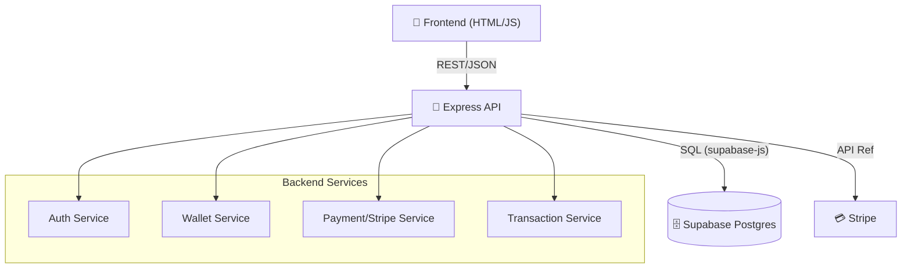
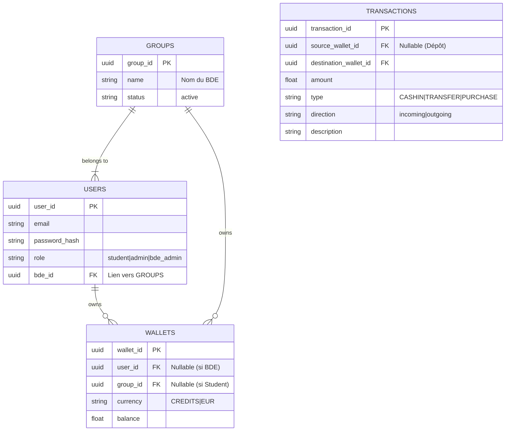

# 📘 Documentation Technique - Wallet IAsansIA

Ce document fournit une vue approfondie de l'architecture, de la base de données et des protocoles utilisés dans le projet Wallet.

---

## 1. Architecture Système

L'application suit une architecture **API REST** monolithique modulaire avec une base de données PostgreSQL gérée par Supabase.

---

## 2. Schéma de Base de Données

Le modèle de données est centré sur les utilisateurs et leurs portefeuilles multiples (EUR/CREDITS).

### Règles de Gestion des Données
1.  **Atomicité** : Les transferts P2P doivent être atomiques (débit + crédit ou rien).
2.  **Devises** :
    *   **EUR** : Utilisé uniquement par les BDE (Recettes).
    *   **CREDITS** : Utilisé par les Étudiants (Gagnés via achat, dépensés pour événements).
3.  **Intégrité** : `source_wallet_id` est `NULL` pour les dépôts externes (Stripe).

---

## 3. Référence API Clé

### Authentification
*   `POST /api/auth/register` : Création de compte. Assigne automatiquement le 1er BDE actif si non spécifié. Crée un wallet CREDITS (0 solde).
*   `POST /api/auth/login` : Retourne un JWT.

### Paiement (Stripe)
*   `POST /api/payment/create-checkout-session`
    *   **Input** : `{ amount: 10, credits: 100 }` (EUR -> Credits)
    *   **Process** : Crée une session Stripe avec metadata (`userId`, `bdeId`).
*   `POST /api/payment/verify-session`
    *   **Input** : `{ sessionId: "cs_test..." }`
    *   **Process** : Vérifie l'état "paid", crédite l'étudiant, crédite le BDE.

### Transactions
*   `POST /api/transactions` (Transfert P2P)
    *   **Input** : Voir README (JSON Protocol).
    *   **Validation** : Vérifie solde suffisant et existence destinataire.

---

## 4. Workflow Critique : Achat de Crédits & "Revenue Split"

C'est le flux le plus complexe, impliquant Stripe et la répartition des fonds.

**Logique de Vérification (`/verify-session`) :**

1.  **Récupération Session** : Appel API Stripe pour obtenir le statut et les métadonnées (`userId`, `creditsAmount`, `bdeId`).
2.  **Sécurité** : Si `payment_status !== 'paid'`, rejet.
3.  **Traitement Étudiant** :
    *   Recherche Wallet `CREDITS` de l'étudiant.
    *   *Auto-Fix* : Si inexistant, création à la volée.
    *   **Action** : Crédit du montant (`transaction_type: CASHIN`).
4.  **Traitement BDE (Revenue Share)** :
    *   Recherche Wallet `EUR` du BDE (`group_id` des metadata).
    *   **Action** : Crédit du montant en Euros (`transaction_type: CASHIN`, `source: NULL`).

```mermaid
sequenceDiagram
    participant Stripe
    participant API
    participant DB

    API->>Stripe: retrieveSession(id)
    Stripe-->>API: {status: 'paid', metadata: {userId, bdeId, eur, credits}}
    
    rect rgb(20, 50, 20)
        Note over API, DB: Crédit Étudiant
        API->>DB: Find/Create Wallet(userId, 'CREDITS')
        API->>DB: Insert Transaction (+Credits)
    end
    
    rect rgb(50, 20, 20)
        Note over API, DB: Crédit BDE (Split)
        API->>DB: Find Wallet(bdeId, 'EUR')
        API->>DB: Insert Transaction (+Euros)
    end
```

---

## 5. Sécurité

*   **JWT (JSON Web Token)** : Utilisé pour sécuriser les routes API. Le token contient `userId` et `role`.
*   **Validation des Entrées** : Utilisation de `express-validator` pour typer et assainir les payloads JSON.
*   **Contraintes BDD** :
    *   `transaction_type` (Enum strict).
    *   `direction` (NOT NULL) pour forcer la clarté des flux.
*   **CORS & Helmet** : Configuration de sécurité Express standard (à renforcer en prod).

---

